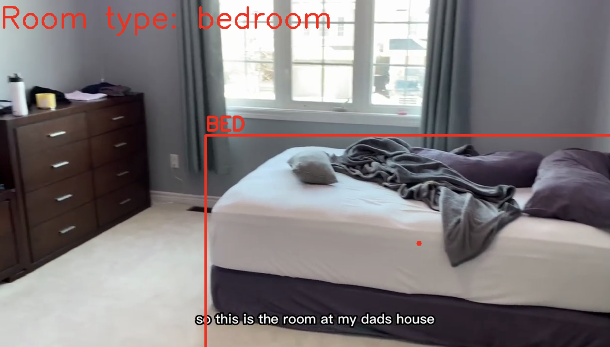

# Room recognizer (YOLOv8)

An implementation of an object detection system using the YOLO model to detect furniture and electronics, and an analysis model to determine the room based on the detected objects.

The code uses two models of neural networks: the first is the YOLO model with default settings, configured to detect a number of objects (equipment, furniture, etc.), on the basis of which, the second model, a custom ANN, will make a decision about which room to be in in frame.

This technology could be used in a variety of household robots (a robotic vacuum cleaner, for example) to increase the efficiency of their work.
